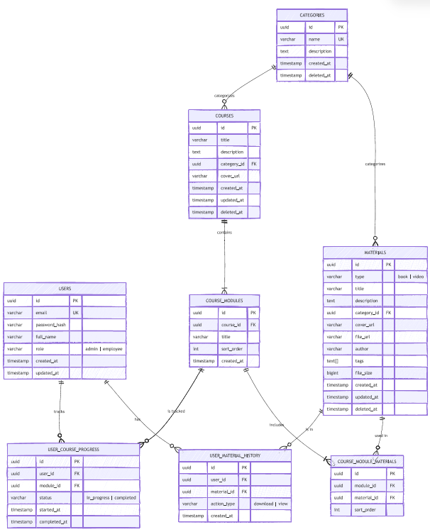
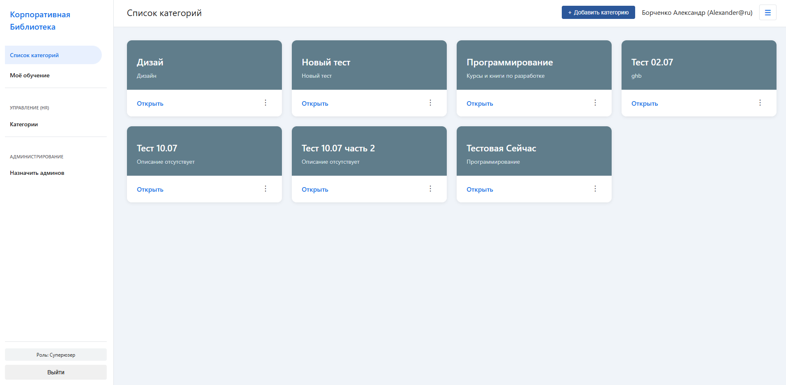
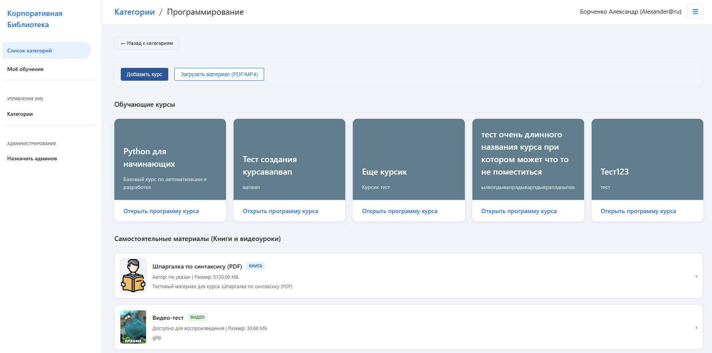
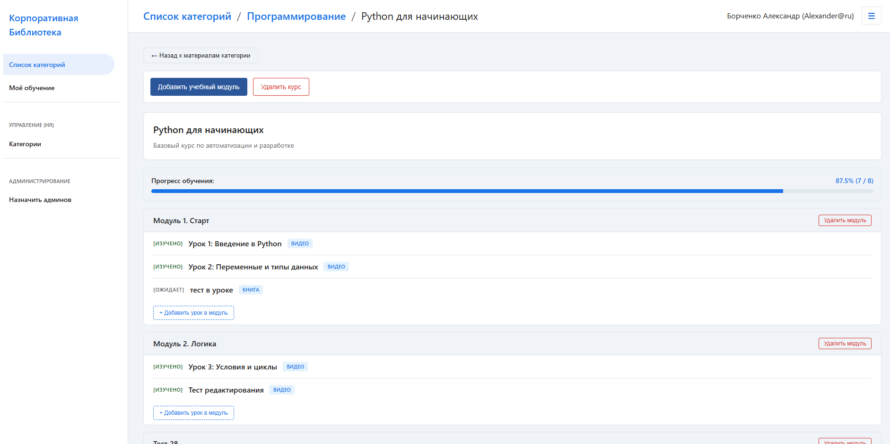
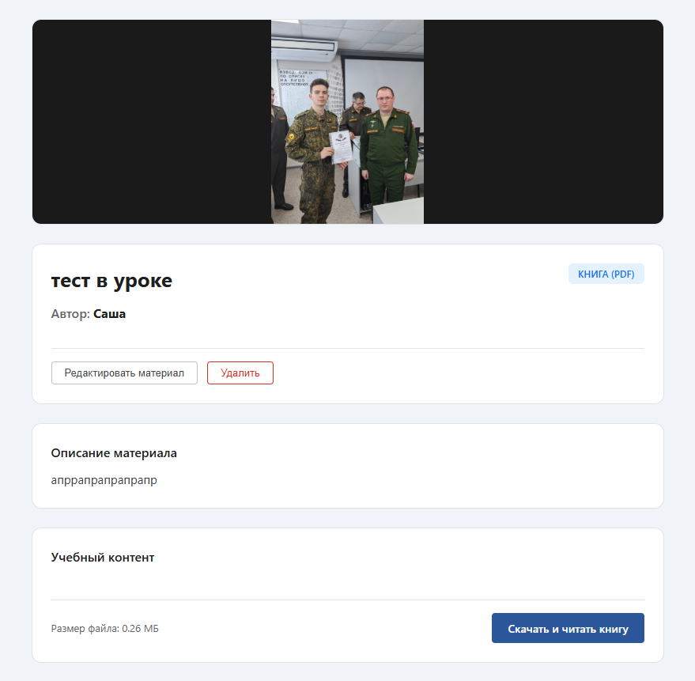
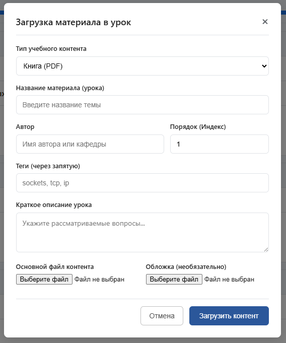
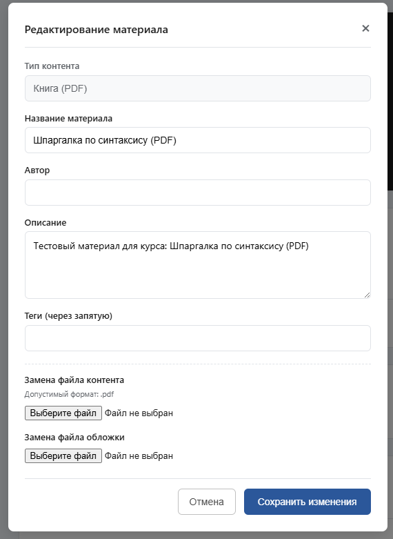
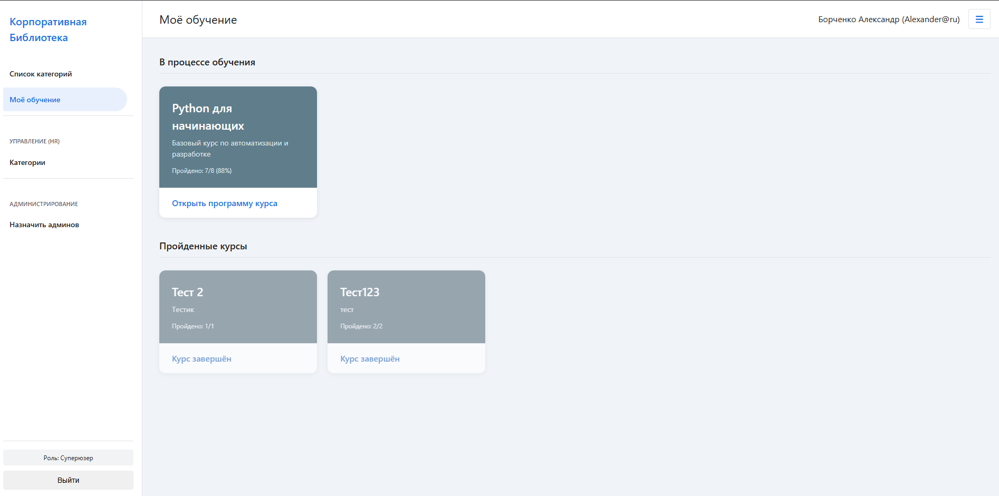
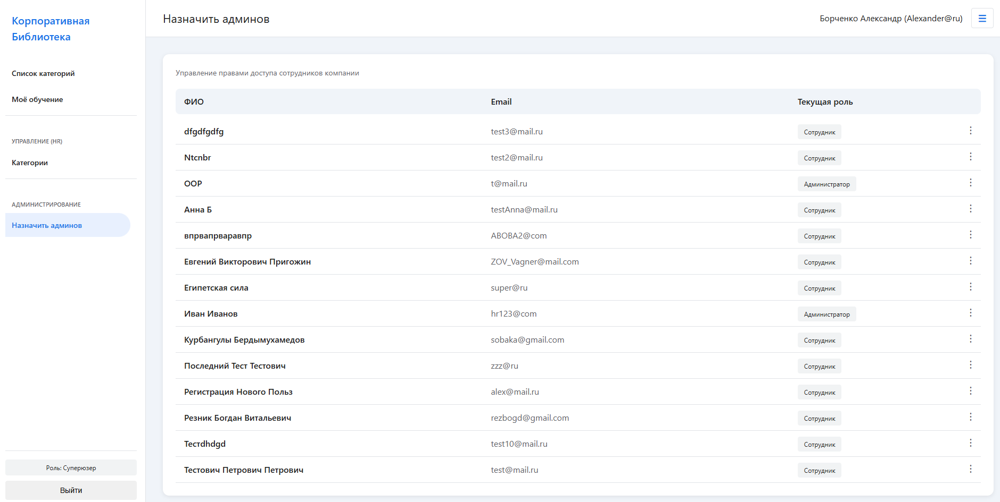

# Корпоративная онлайн-библиотека
## Backend-часть

Бэкенд для корпоративной онлайн-библиотеки. Представляет собой API на Flask для управления учебными и рабочими материалами компании.

---

## Стек технологий Backend
* **Язык:** Python 3.11+
* **Фреймворк:** Flask
* **База данных:** PostgreSQL
* **ORM:** Flask-SQLAlchemy
* **Авторизация и безопасность:** Flask-JWT-Extended + PyJWT + Werkzeug
* **Валидация и сериализация данных:** Marshmallow
* **Интерактивность:** Flask-SocketIO

---

## Быстрый запуск локально

Инструкция для развертывания бэкенда в локальном окружении разработки.

### 1. Клонирование репозитория
```bash
git clone https://github.com/MaxLeywyn/CorpLib.git
cd CorpLib
```

### 2. Настройка виртуального окружения

Для Windows:
```bash
python -m venv venv
venv\Scripts\activate
```

Для Mac/Linux:
```bash
python3 -m venv venv
source venv/bin/activate
```

### 3. Установка зависимостей
```bash
pip install --upgrade pip
pip install -r requirements.txt
```

### 4. Конфигурация базы данных

Перед запуском убедитесь, что у вас поднят локальный сервер PostgreSQL и создана база данных для проекта. Строка подключения к базе данных настраивается в файле app/config.py

### 5. Запуск приложения
```bash
python app.py
```

После старта бэкенд-сервер будет доступен по адресу: http://127.0.0.1:5000/

## Архитектура данных (ER-Диаграмма)

Для управления пользователями, курсами и учебными материалами используется реляционная база данных PostgreSQL. Взаимосвязи сущностей представлены на ER-диаграмме ниже:



## Ключевые роуты бэкенд-API

Логика приложения разделена на независимые модули в пакете `routes/`:

| Модуль | Метод | Эндпоинт | Описание |
| :--- | :--- | :--- | :--- |
| **`auth.py`** | **POST** | `/api/auth/register` | Регистрация нового сотрудника |
| | **POST** | `/api/auth/login` | Аутентификация и выдача JWT-токена |
| **`courses.py`** | **GET** | `/api/courses` | Получение списка доступных курсов |
| | **GET** | `/api/courses/<id>` | Детальная структура курса и прогресс |
| | **POST** | `/api/courses` | Создание нового обучающего курса |
| **`materials.py`**| **GET** | `/api/materials/<id>` | Получение лекций/файлов уроков (PDF, MP4) |
| | **POST** | `/api/materials` | Загрузка новых учебных материалов |
| **`history.py`** | **GET** | `/api/history` | Просмотр истории обучения сотрудника |
| | **POST** | `/api/history/track` | Фиксация прогресса и завершения уроков |
| **`admin.py`** | **GET** | `/api/admin/users` | Получение списка сотрудников платформы |
| | **PUT** | `/api/admin/users/<id>` | Изменение ролей пользователей и прав |

## Frontend-часть

---

## Стек технологий Frontend
*   **Архитектура:** Single Page Application
*   **Основа:** Vanilla JS, HTML5, CSS3
*   **Адаптивная и современная верстка:**
    *   CSS Grid & Flexbox
    *   CSS Variables
    *   Media Queries

##  Интерфейс приложения

### 1. Главная страница



### 2. Выбранная категория



### 3. Выбранный обучающий курс



### 4. Выбранный урок



### 5. Загрузка материала в урок



### 6. Редактирование материала



### 7. Раздел Моё обучение



### 8. Панель администрирования

